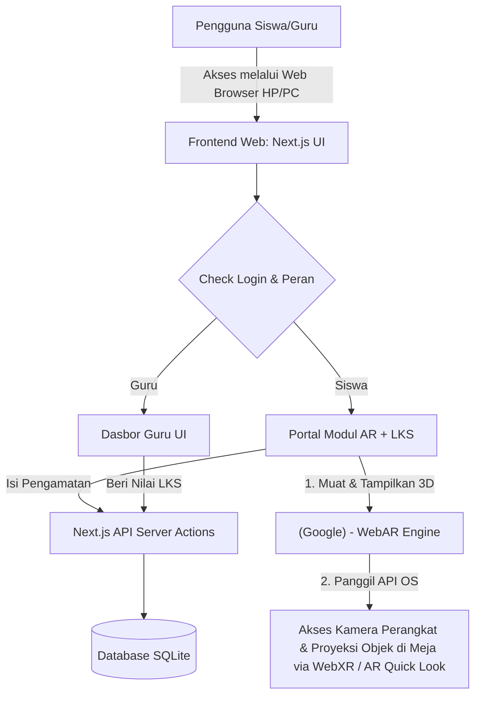
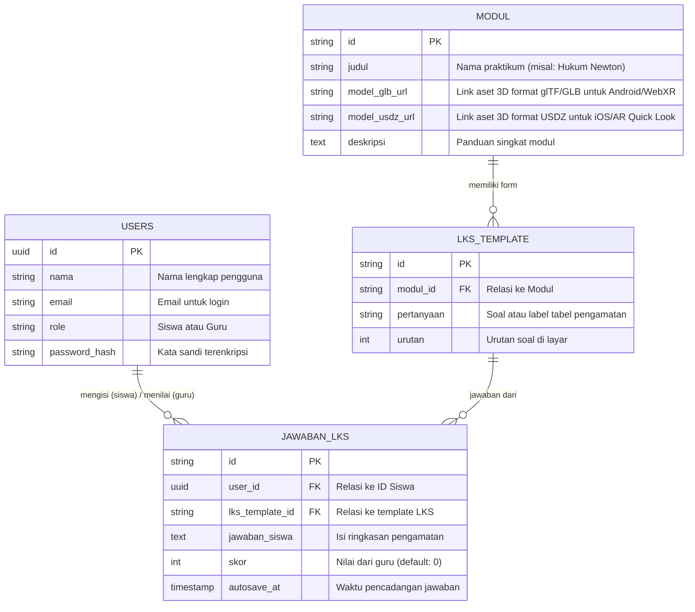

# PRD — Project Requirements Document

## 1. Overview
Sekolah-sekolah di daerah pelosok atau beranggaran terbatas seringkali menghadapi kesenjangan fasilitas laboratorium fisik. Akibatnya, siswa SMP/SMA hanya bisa mempelajari sains secara teori melalui buku atau YouTube, membuat mereka kurang terampil menggunakan alat lab nyata. Praktikum konvensional juga terhalang oleh keterbatasan ruang dan waktu.

**PintAR (Praktikum Interaktif Augmented Reality)** hadir sebagai solusi berupa laboratorium virtual berbasis WebAR. Tanpa perlu menginstal aplikasi berat yang memakan memori HP, siswa dapat memproyeksikan alat lab 3D langsung ke atas meja mereka hanya melalui browser HP. Momen "Aha!" terjadi saat siswa pertama kali melihat alat lab sains seolah-olah nyata ada di depan mereka, dan bisa dioperasikan sambil mengisi Lembar Kerja Siswa (LKS) di layar yang sama sesuai arahan guru. 

## 2. Requirements
- **Berbasis Web yang Ringan & Inklusif:** Aplikasi dapat diakses langsung lewat browser dan berjalan mulus secara *cross-platform* (Android & iOS). Bebas diunduh dan tidak menyita ruang penyimpanan *smartphone*.
- **Augmented Reality Jarak Dekat:** Teknologi AR yang stabil agar benda 3D dapat "diletakkan" (diproyeksikan) secara akurat di atas permukaan meja belajar.
- **Layar Terbagi (Split-screen) AR & LKS:** Tampilan praktikum harus memadukan interaksi visual 3D (AR) di bagian utama dan kolom isian LKS di panel yang mudah dijangkau pada layar yang sama.
- **Sistem Peran Bersarang (Role-Based):** Akses antarmuka yang berbeda untuk Siswa (fokus pada praktikum AR dan pengisian LKS) dan Guru (fokus pada pantauan progres dan penilaian).
- **Fokus Prioritas (MVP):** Kendala teknis diarahkan pada kestabilan AR dan kelancaran UX; sementara fitur akun dan form cukup dibuat fungsional dan sederhana.

## 3. Core Features
Sesuai dengan kerangka kerja fase pertama, berikut adalah fitur inti aplikasi:

**Fase 1**
*   **Modul Praktikum AR** [high] — Menampilkan alat lab 3D di meja pengguna dan memandu langkah percobaan secara interaktif.
    *   **Proyeksi Alat 3D:** Memunculkan model alat lab virtual di permukaan meja melalui kamera HP.
    *   **Panduan Langkah:** Menampilkan instruksi visual tahap demi tahap selama praktikum berlangsung.
    *   **Interaksi Objek:** Memungkinkan siswa menyentuh atau menggerakkan alat 3D untuk simulasi penggunaan.
    *   **Deteksi Otomatis:** Mengandalkan `<model-viewer>` dari Google yang secara otomatis mendeteksi perangkat pengguna dan memilih teknologi AR paling ringan yang tersedia (misalnya: WebXR untuk Android, AR Quick Look untuk iOS), sehingga tidak memerlukan konfigurasi manual.
*   **LKS Digital** [high] — Menyediakan lembar kerja digital yang bisa diisi siswa langsung saat praktikum AR berjalan.
    *   **Isi Data Pengamatan:** Formulir di layar yang sama untuk mencatat hasil pengamatan praktikum.
    *   **Simpan Otomatis:** Menyimpan jawaban siswa secara berkala agar tidak hilang saat koneksi tidak stabil.
    *   **Lihat Nilai:** Menampilkan hasil penilaian dari guru setelah LKS diperiksa.
*   **Dasbor Guru** [medium] — Panel bagi guru untuk memantau progres praktikum dan nilai LKS siswa.
    *   **Daftar Siswa Aktif:** Melihat siswa mana yang sedang atau sudah menyelesaikan praktikum.
    *   **Periksa LKS:** Membuka dan menilai lembar kerja siswa satu per satu.
    *   **Rekap Nilai:** Melihat ringkasan pencapaian seluruh siswa dalam satu modul.
*   **Autentikasi** [medium] — Sistem login sederhana untuk membedakan akses Siswa dan Guru.
    *   **Daftar Akun:** Membuat akun baru dengan memilih peran sebagai Siswa atau Guru.
    *   **Masuk & Keluar:** Login dan logout untuk mengamankan data praktikum dan LKS.
*   **Onboarding Interaktif** [low] — Panduan singkat pertama kali membuka aplikasi agar siswa langsung paham cara memulai AR.
    *   **Tur Visual:** Beberapa langkah animasi yang menunjukkan cara mengarahkan kamera dan memunculkan alat di meja.
    *   **Coba Langsung:** Tombol untuk langsung masuk ke modul AR setelah atau tanpa mengikuti tur.

* **Mode 3D Fallback:** Jika sensor AR/kamera tidak mendukung atau kondisi lingkungan tidak memadai (misalnya ruangan terlalu gelap, permukaan meja tidak terdeteksi), sistem secara otomatis menyediakan tampilan 3D interaktif 360° di layar (non-AR) sehingga siswa tetap bisa memutar, zoom, dan mengamati alat lab dari segala sisi. Fitur ini memastikan praktikum tetap berjalan tanpa diskriminasi perangkat, menunjukkan inklusivitas teknologi bagi siswa dengan perangkat terbatas.

## 4. User Flow
**Alur Siswa:**
1. Mengakses situs web PintAR melalui browser HP.
2. Login sebagai *Siswa* (atau melewati Tur Visual Interaktif jika baru pertama kali).
3. Memilih "Modul Praktikum" yang ditugaskan oleh guru.
4. Memberikan izin akses kamera, lalu mengarahkan ke meja untuk memunculkan model 3D (Aha moment!).
5. Mengikuti panduan langkah percobaan dari layar.
6. Mengamati interaksi alat 3D di area atas layar, sambil secara bersamaan mengisi tabel/pertanyaan pada LKS Digital yang ditampilkan di panel bawah. Tampilan split-screen ini memungkinkan praktikum berjalan tanpa perlu berpindah tab atau aplikasi.
7. Mengumpulkan LKS (jawaban otomatis tersimpan jika asik mencoba alat).
8. Melihat nilai akhir setelah diperiksa Guru.

**Alur Guru:**
1. Login di web sebagai *Guru*.
2. Masuk ke halaman Dasbor Guru.
3. Memilih kelas dan modul praktikum pelajaran terkait.
4. Memonitor "Daftar Siswa" untuk melihat siapa yang sudah selesai mengumpulkan LKS.
5. Mengklik akun siswa tertentu, memeriksa jawaban LKS mereka, dan memberikan skor/nilai.
6. Mengunduh/melihat Rekap Nilai sekelas.

## 5. Architecture
Aplikasi mengusung arsitektur *Client-Server* modern. Proses berat untuk perenderan AR sepenuhnya ditangani oleh komponen `<model-viewer>` dari Google yang berjalan di antarmuka web. `<model-viewer>` secara cerdas memanggil API bawaan sistem operasi (WebXR untuk Android, AR Quick Look untuk iOS) sehingga ponsel tidak terbebani pemrosesan tambahan dan memori tetap ringan. Data seperti skor dan isian lembar kerja disimpan di server database.

## 6. Database Schema
Sistem menggunakan database relasional sederhana untuk mendukung performa cepat dan pencatatan nilai yang presisi.

## 7. Tech Stack
Aplikasi menggunakan pondasi teknologi web modern, dipadukan khusus dengan *library* ringan Google untuk menjalankan Augmented Reality lintas perangkat tanpa harus mengunduh aplikasi di PlayStore/AppStore.

*   **Frontend (Web & UI):** Next.js (React framework) untuk kemudahan *routing* dan optimasi muat halaman.
*   **Styling & Komponen:** Tailwind CSS & shadcn/ui untuk *dashboard* guru yang bersih, profesional, dan responsif.
*   **WebAR Engine (Pemutar 3D):** `<model-viewer>` dari Google, sebagai standar implementasi yang stabil dan teruji. Library antarmuka ini otomatis mendeteksi OS (*WebXR* untuk Android, *AR Quick Look* untuk iOS Safari) agar objek menempel di meja secara optimal dan ringan, tanpa memerlukan logika deteksi buatan sendiri.
*   **Backend:** Next.js Server Actions & API routes terintegrasi dalam satu repo (Full-stack).
*   **Database:** SQLite disokong platform seperti Turso untuk kecepatan akses secara regional dengan penyimpanan yang efisien.
*   **ORM (Penghubung Database):** Drizzle ORM (cepat, deteksi *type-safe* cocok dengan Next.js).
*   **Autentikasi:** Better Auth (mudah di-setup, mendukung sistem Role-based: Siswa dan Guru).