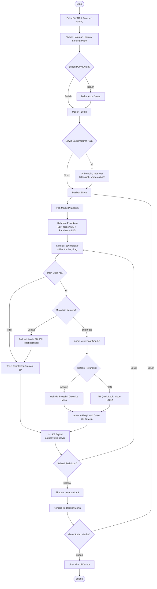
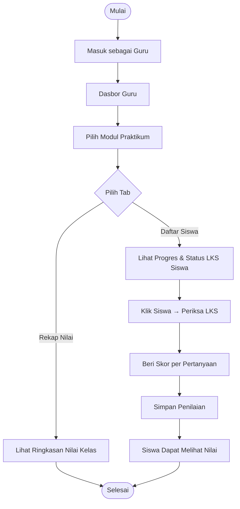
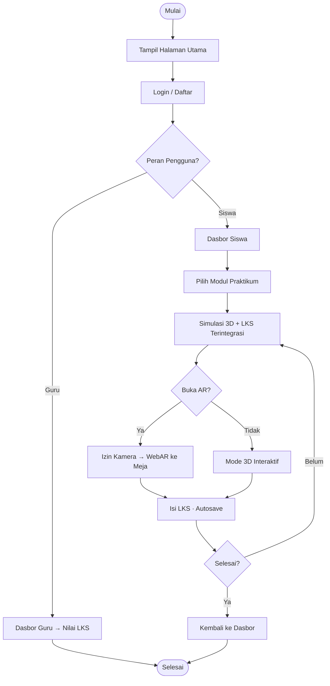

# Gambar 4.1.1 — Workflow System PintAR (Revisi 2026)

Workflow baru untuk proposal LIDM. Menggantikan diagram lama yang masih memakai **Cetak Marker**, **Marker Hiro**, dan **deteksi marker**.

**Perubahan utama:**
- ❌ Hapus: Cetak Marker, Marker Hiro, Scan-Hero, pilihan terpisah Mode Simulasi vs Mode AR
- ✅ Tambah: Login/Daftar, Onboarding, Dasbor Siswa/Guru, LKS Digital, WebAR tanpa marker

---

## Diagram 1 — Alur Siswa (utama, untuk Gambar 4.1.1)

Gunakan diagram ini sebagai pengganti workflow lama di proposal.



---

## Diagram 2 — Alur Guru (lampiran / sub-diagram)

Bisa dimasukkan sebagai Gambar 4.1.2 atau digabung di bawah diagram siswa.



---

## Diagram 3 — Versi ringkas (mirip layout proposal lama)

Kalau mau satu diagram vertikal sederhana seperti gambar lama:



---

## Narasi Bab 4.1 (siap salin ke proposal)

### a. Akses Aplikasi
Sistem menampilkan halaman utama PintAR sebagai tampilan awal. Pengguna mengakses platform melalui peramban web pada perangkat HP atau PC tanpa perlu menginstal aplikasi.

### b. Autentikasi
Pengguna mendaftar atau masuk ke akun. Sistem membedakan peran **Siswa** dan **Guru**. Guru mendaftar dengan kode undangan khusus. Setelah autentikasi berhasil, pengguna diarahkan sesuai perannya.

### c. Onboarding Siswa Baru
Siswa yang baru pertama kali login mengikuti tur interaktif singkat yang menjelaskan cara memberikan izin kamera dan memulai praktikum AR.

### d. Dasbor Siswa
Siswa melihat daftar modul praktikum, dapat memfilter berdasarkan kategori (Fisika, Kimia, Astronomi), melihat progres LKS, dan melanjutkan modul terakhir.

### e. Pemilihan Modul Praktikum
Siswa memilih modul yang ingin dipelajari. Sistem memuat halaman praktikum dengan tampilan terbagi: simulasi 3D di bagian atas, panduan langkah, dan LKS digital di panel bawah.

### f. Simulasi 3D Interaktif
Siswa berinteraksi dengan simulasi melalui kontrol (slider, tombol, drag). Sistem memproses input dan memperbarui animasi secara real-time agar konsep sains lebih mudah dipahami.

### g. Mode Augmented Reality (WebAR)
Siswa dapat mengaktifkan mode AR untuk memproyeksikan model 3D ke permukaan meja. Sistem meminta izin kamera. Jika ditolak atau perangkat tidak mendukung, otomatis beralih ke tampilan 3D 360°. Jika diizinkan, `model-viewer` memanggil WebXR (Android) atau AR Quick Look (iOS) — **tanpa marker fisik**.

### h. Pengisian LKS Digital
Selama praktikum, siswa mengisi pertanyaan pengamatan di LKS digital pada layar yang sama. Jawaban disimpan otomatis ke server secara berkala.

### i. Penilaian oleh Guru
Guru masuk ke dasbor, memilih modul, memantau progres siswa, memeriksa jawaban LKS, dan memberikan skor. Siswa dapat melihat nilai setelah penilaian selesai.

### j. Penyelesaian Sesi
Setelah selesai, siswa kembali ke dasbor atau memilih modul lain. Progres dan jawaban LKS tersimpan di database.

---

## Perbandingan: Workflow Lama vs Baru

| Tahap | Proposal lama | PintAR sekarang |
|-------|---------------|-----------------|
| Awal | Cek sensor HP | Buka browser → Landing |
| Menu utama | Cetak Marker \| Mulai Praktikum | Login / Daftar |
| Marker | Unduh & cetak Marker Hiro | ❌ Tidak ada |
| Pilih mode | Simulasi **atau** AR (terpisah) | Simulasi **dan** AR dalam satu layar |
| AR | Deteksi marker → render di atas marker | WebXR / Quick Look → proyeksi ke meja |
| Gagal AR | Kembali ke daftar eksperimen | Fallback 3D 360° (tetap di praktikum) |
| Interaksi | Slider + goyang HP | Slider, tombol, drag |
| LKS | ❌ Tidak ada | ✅ Terintegrasi + autosave |
| Guru | ❌ Tidak ada | ✅ Dasbor pantau & nilai |
| Selesai | Kembali ke menu utama | Kembali ke dasbor + lihat nilai |

---

## Cara render diagram jadi gambar (untuk Word/PDF)

### Opsi A — Mermaid Live Editor (gratis, cepat)
1. Buka https://mermaid.live
2. Salin isi diagram dari file ini
3. Export PNG/SVG
4. Sisipkan ke proposal sebagai **Gambar 4.1.1**

### Opsi B — draw.io / diagrams.net
1. Buka https://app.diagrams.net
2. Pakai prompt AI di bawah → paste struktur node
3. Atur style: oval = mulai/selesai, kotak = proses, belah ketupat = keputusan
4. Export PNG

### Opsi C — Canva / PowerPoint
Gunakan prompt AI di bawah untuk generate layout, lalu rapikan manual.

---

## Prompt AI untuk bikin diagram visual (copy-paste)

### Prompt 1 — Untuk ChatGPT / Claude (generate Mermaid atau deskripsi visual)

```
Buatkan flowchart vertikal untuk proposal akademik berjudul "Gambar 4.1.1 Workflow System PintAR".

Konteks: PintAR adalah platform web praktikum sains berbasis WebAR untuk siswa SMP/SMA Indonesia. TIDAK memakai marker fisik atau Scan-Hero.

Alur yang harus ada (dari atas ke bawah):
1. Mulai
2. Buka PintAR di browser
3. Halaman Utama (Landing Page)
4. Keputusan: Sudah punya akun? → Daftar atau Login
5. Keputusan: Siswa baru? → Onboarding 3 langkah atau langsung Dasbor Siswa
6. Dasbor Siswa → Pilih Modul Praktikum
7. Halaman Praktikum split-screen (Simulasi 3D + Panduan + LKS)
8. Simulasi 3D interaktif (slider, tombol)
9. Keputusan: Buka AR? 
   - Jika ya → Minta izin kamera → WebXR (Android) atau AR Quick Look (iOS) → proyeksi objek ke meja TANPA marker
   - Jika ditolak → Fallback 3D 360°
10. Isi LKS Digital dengan autosave
11. Keputusan: Selesai praktikum? → loop kembali atau simpan
12. Kembali ke Dasbor → Lihat nilai setelah guru menilai
13. Selesai

JANGAN sertakan: Cetak Marker, Marker Hiro, deteksi marker, Scan-Hero, pilihan terpisah "Mode Simulasi vs Mode AR".

Output: kode Mermaid flowchart TD yang rapi, label dalam Bahasa Indonesia, siap di-render di mermaid.live.
```

### Prompt 2 — Untuk Napkin.ai / Gamma / alat diagram AI

```
Create a vertical academic flowchart diagram titled "Gambar 4.1.1 Workflow System PintAR".

Style: clean, professional, black and white, suitable for Indonesian university proposal (LIDM). Use standard flowchart shapes: ovals for start/end, rectangles for processes, diamonds for decisions. Vertical top-to-bottom layout.

Flow (in Indonesian):
Start → Open PintAR in browser → Landing Page → Login/Register → Student Dashboard → Select practicum module → Practicum page (split-screen: 3D simulation + worksheet) → Interactive 3D simulation → Optional: Open AR? → Camera permission → WebAR projection on desk (no physical marker) OR 3D fallback → Fill digital worksheet (autosave) → Finished? → Back to dashboard → View grade → End.

Do NOT include: print marker, Hiro marker, marker detection, Scan-Hero, separate simulation vs AR mode selection.

Also create a smaller secondary branch for Teacher: Login → Teacher Dashboard → Select module → Review student worksheet → Give scores.
```

### Prompt 3 — Untuk DALL-E / image generator (jika butuh mockup visual)

```
Technical flowchart diagram, vertical layout, academic proposal style, black lines on white background, Indonesian text labels. Title at top: "Gambar 4.1.1 Workflow System PintAR". Shows web app user flow: browser access, login, student dashboard, select science module, 3D simulation with digital worksheet, optional WebAR camera mode projecting 3D lab equipment on desk without markers, autosave, teacher grading, view score. Professional UML flowchart, no colors, print-ready, high contrast.
```

> **Catatan:** Generator gambar AI kadang salah tulis teks. Lebih aman pakai **Mermaid Live** atau **draw.io** lalu edit label manual.

### Prompt 4 — Untuk draw.io dengan AI (Describe diagram)

```
Flowchart vertikal, bahasa Indonesia, judul "Workflow System PintAR".

Node proses:
- Buka PintAR di Browser
- Halaman Utama
- Login / Daftar
- Onboarding Siswa Baru (3 langkah)
- Dasbor Siswa
- Pilih Modul Praktikum
- Halaman Praktikum (3D + LKS)
- Simulasi 3D Interaktif
- Aktifkan WebAR (tanpa marker)
- Isi LKS Digital
- Simpan Jawaban
- Lihat Nilai

Node keputusan:
- Sudah punya akun?
- Siswa baru?
- Buka AR?
- Izin kamera?
- Selesai praktikum?

Cabang AR:
- Diizinkan → WebXR / AR Quick Look → Proyeksi ke Meja
- Ditolak → Fallback 3D 360°

Hapus semua node tentang marker dan cetak marker.
```

---

## Tips agar mirip gambar proposal lama

1. **Layout vertikal** — alur dari atas ke bawah, seperti diagram lama.
2. **Belah ketupat** untuk keputusan (Login?, Buka AR?, Selesai?).
3. **Satu diagram fokus siswa** sebagai Gambar 4.1.1; alur guru bisa Gambar 4.1.2.
4. **Hindari istilah teknis** di label diagram: pakai "Proyeksi Objek ke Meja" bukan "model-viewer WebXR".
5. **Tambahkan kotak "Sistem Cek Perangkat"** opsional setelah Landing jika ingin mirip proposal lama — isinya: cek dukungan kamera & AR, bukan cek sensor goyang.

---

*File ini melengkapi `docs/SELARASAN-PROPOSAL-LIDM.md` untuk revisi Bab 4.1 proposal LIDM.*
